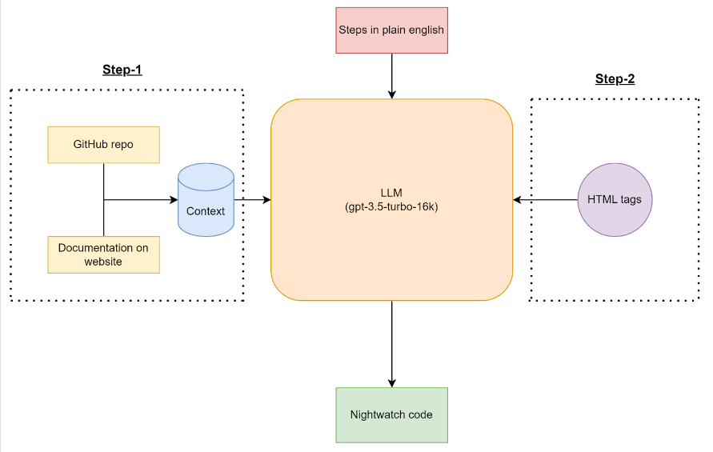

## The main idea: 
To convert the natural language testing commands into executable code. <br>
Here we are going to use Nightwatch.js for the automation scripts.

### Example:
Steps:
 - Go to Youtube.com
 - Search for vitaracharts
 - Click on the first video
 - Save the screenshot 

Code:
```js
module.exports = {
    'Demo'(browser) {
        browser
            .url('https://www.youtube.com/')
            .setValue('input[id="search"]',"vitaracharts")
            .click('button[id="search-icon-legacy"]')
            .pause(2000)
            .click('a[id="video-title"]')
            .pause(2000)
            .saveScreenshot("tests_output/img.png")
    }
};
```
Since we can't fine-tune the LLM for our task, we will try to teach LLMs by using a few-shot example, along with plain English to Nightwatch mapping. This is to make LLM understand the set of rules that map the plain English steps to Nightwatch.js actions. For example: 
```
Open the URL ⇒ browser.url(<url given by user>)
Click the search button ⇒ browser.click(<some html tag>)
Verify <text> is present or not ⇒ browser.assert.containsText(<text>)
```
We must also extract relevant HTML tags, like for YouTube
```
For search bar ⇒ 'input[id="search"]'
For search button ⇒ 'button[id="search-icon-legacy"]'
For selecting the video ⇒ 'a[id="video-title"]'
```
 After extracting, the LLM uses these tags to fill in the blanks in the Nightwatch commands.
<hr>

## Method
So, we have divided the task into two steps per se. <br>
**First task**: Define Rule-based Mapping
- From plain English language to Nightwatch.js syntax.
- This is basically the context that we are providing to the LLM. 
- We would be using Nightwatch’s website, which has all the commands listed precisely. 
- We would also use its GitHub repository, which has an additional set of examples and code. <br>

**Second task**: Extract the HTML tag
- To create the mapping of the sections of the web browser to the HTML tags.
- Currently, we are thinking of utilizing Nightwatch’s in-built find commands to extract relevant HTML tags.
- Another approach is to observe and get all the relevant tags using the beautifulsoup scraping tool. This is a brute-force approach as we don't want all the tags, only some specific tags.
<hr>

## Flowchart
